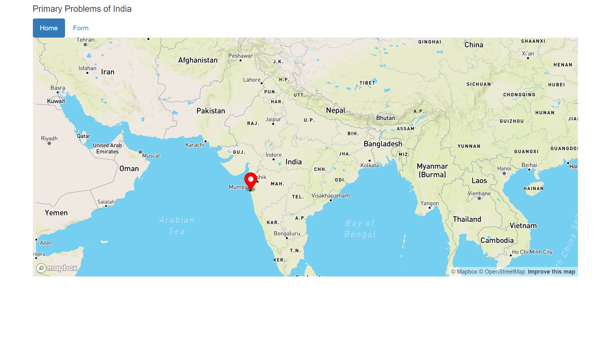
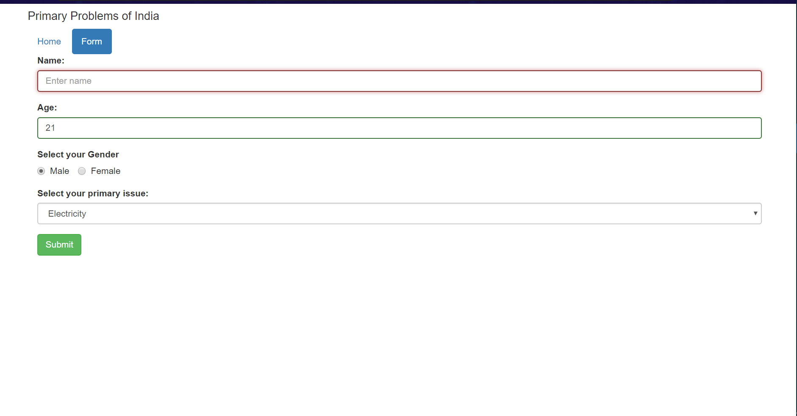

# Primary-Problems-of-India
It displays the Problem of Indian on a map with the help of markers. For example if they don’t have a water supply at their home or they are not getting clean water they can fill the form, then a new marker will be added to the map on their location.

step 1: open WAMP or XAMP and create a database name="problem_solver" and import the problem_solver.sql file

step 2:run the index.php file

(Note: As of Chrome 50, the Geolocation API will only work on secure contexts such as HTTPS.
If your site is hosted on an non-secure origin (such as HTTP) the requests to get the users location will no longer function.)

